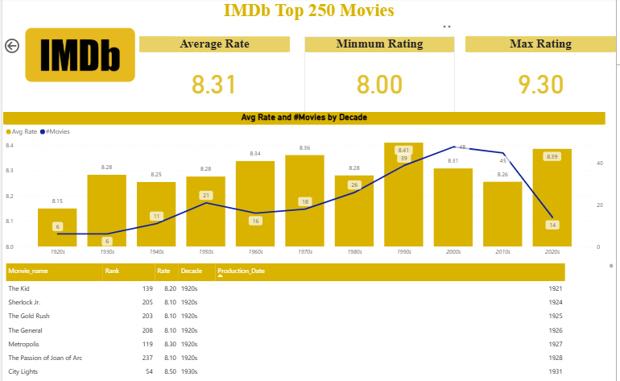

# Web-Scraping-IMDb-Data-with-Power-BI
Web scraping and visualization project using Power BI to analyze IMDb’s Top 250 Movies.
# 🎬 IMDb Top 250 Movies — Web Scraping & Dashboard in Power BI
### 👩‍💻 Developed by [Aya Gamal](https://linkedin.com/in/aya-gamal-senara)

This project demonstrates how to **extract live data from IMDb’s website** using **Power BI’s Web connector**, clean it in **Power Query**, and visualize insights through an **interactive dashboard**.  
The goal is to explore how movie ratings evolved across decades and identify overall performance trends in the IMDb Top 250 list.

---

## 🚀 Project Overview
**Objective:**  
Build a complete data analysis solution inside **Power BI** — from **web scraping** to **data visualization**, without writing any code.

### 🔹 Key Questions:
- What is the **average IMDb rating** of Top 250 movies?  
- Which **decade** has the highest number of top-rated films?  
- What are the **minimum and maximum ratings** among the Top 250?  
- How did movie quality evolve over time?

---

## 🌐 Step 1: Web Scraping (Power BI Web Connector)
Power BI allows importing HTML data directly from the web.

### Steps:
1. **Home → Get Data → Web**  
2. Paste this URL:  
   ```
   https://www.imdb.com/chart/top/
   ```
3. Power BI detects available HTML tables from the IMDb Top 250 page.  
4. Select the correct table and load it into **Power Query Editor**.

---

## 🧹 Step 2: Data Cleaning (Power Query)
Performed all cleaning and transformation steps within **Power Query**:

| Step | Description |
|------|-------------|
| 🧾 Rename Columns | `Movie_name`, `Rate`, `Rank`, `Production_Date` |
| 🔢 Change Data Types | `Rate` → Decimal, `Production_Date` → Whole Number |
| 🧽 Extract Decade | Created a new column “Decade” using custom transformation |
| 🔄 Remove extra text | Removed brackets and unwanted characters from year data |
| ⚙️ Sort Data | Sorted by Rating (Descending) |

After cleaning, the dataset was fully ready for analysis and visualization.

---

## 📊 Step 3: Power BI Dashboard

### 🖼️ Dashboard Preview
Below is the interactive dashboard designed in Power BI 👇



### Dashboard Components:
- ⭐ **Average Rating:** 8.31  
- 🔻 **Minimum Rating:** 8.00  
- 🔺 **Maximum Rating:** 9.30  
- 📅 **Average Rating & Number of Movies by Decade**  
- 📋 **Detailed Movie Table** showing name, rank, rating, and production date  

---

## 💡 Insights & Findings
- 🎞️ The **1990s** had the highest number of top-rated movies with an average rating of **8.41**.  
- ⭐ Ratings across decades are consistently high (8.0–9.3), showing steady film quality.  
- 🏆 *The Shawshank Redemption (1994)* remains the **highest-rated movie** (9.3).  
- 🎬 Classic eras like the **1970s** and **2000s** also produced several critically acclaimed movies.  

---

## 🛠️ Tools & Technologies
| Tool | Purpose |
|------|----------|
| **Power BI** | Web scraping, data modeling, and visualization |
| **Power Query** | Data cleaning and transformation |
| **DAX** | KPIs (Average, Min, Max Ratings) |
| **IMDb Website** | Data source for Top 250 movies |

---

## 📚 Future Improvements
- Add **genre, director, and runtime** columns from each movie page.  
- Compare IMDb ratings with **Rotten Tomatoes** or **Metacritic**.  
- Automate **scheduled refresh** in Power BI Service for live data updates.  

---

## 🏷️ GitHub Repo Description
> Power BI project demonstrating web scraping, data cleaning, and interactive dashboard creation using IMDb’s Top 250 Movies dataset.

---

## 🔗 Connect
📧 [ayagama662@gmail.com](mailto:ayagama662@gmail.com)  
🔗 [LinkedIn](https://linkedin.com/in/aya-gamal-senara)
